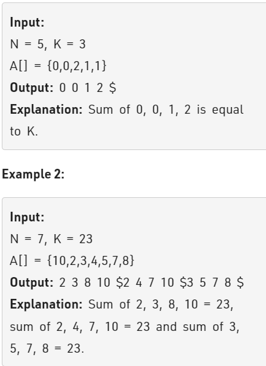

Problem Link : https://practice.geeksforgeeks.org/problems/find-all-four-sum-numbers1732/1

Problem Statement : Given an array of integers and another number. Find all the unique quadruple from the given array that sums up to the given number.



--------------------------------------------------------------------------------------------------
Solution : 

Code : 

```


class Solution{
    public:
    // arr[] : int input array of integers
    // k : the quadruple sum required
    vector<vector<int> > fourSum(vector<int> &arr, int k) {
        // Your code goes here
        int n = arr.size();
        set<vector<int>> s;
        sort(arr.begin(), arr.end());
        for(int i=0;i<n-3;i++){
            for(int j=i+1;j<n-2;j++){
                int start = j+1;
                int end = n-1;
                while(start < end){
                    int sum = arr[i] + arr[j] + arr[start] + arr[end];
                    if(sum == k){
                        vector<int> temp;
                        temp.push_back(arr[i]);
                        temp.push_back(arr[j]);
                        temp.push_back(arr[start]);
                        temp.push_back(arr[end]);
                        // sort(temp.begin(), temp.end());
                        s.insert(temp);
                        start++;
                    }
                    else if(sum < k) start++;
                    else end--;
                }
            }
        }
        vector<vector<int>> ans;
        for(auto & v : s){
            ans.push_back(v);
        }
        return ans;
    }
};


TC : O(n^3log(n))
SC : O(n)

```