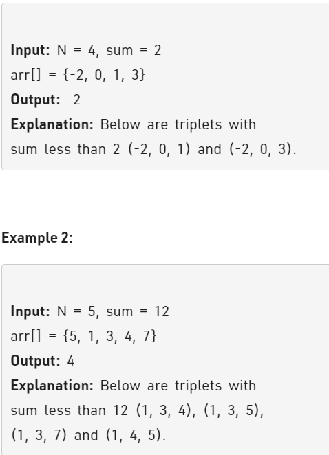

Problem Link : https://practice.geeksforgeeks.org/problems/count-triplets-with-sum-smaller-than-x5549/1

Problem Statement : Given an array arr[] of distinct integers of size N and a value sum, the task is to find the count of triplets (i, j, k), having (i< j< k) with the sum of (arr[i] + arr[j] + arr[k]) smaller than the given value sum.



---------------------------------------------------------------------------------------------------------

Solution : 

```
class Solution{
	
	
	public:
	long long countTriplets(long long arr[], int n, long long sum){
	    sort(arr, arr+n);
	    long long ans= 0;
	    for(int i=0;i<n;i++){
	        int lo = i+1, hi = n-1;
	        while(lo < hi){
	            if(arr[i] + arr[lo] + arr[hi] < sum){
	                ans += (hi - lo);
	                lo++;
	            }
	            else{
	                hi--;
	            }
	        }
	    }
	    return ans;
	}
};

TC : O(n^2)
SC : O(1)

```