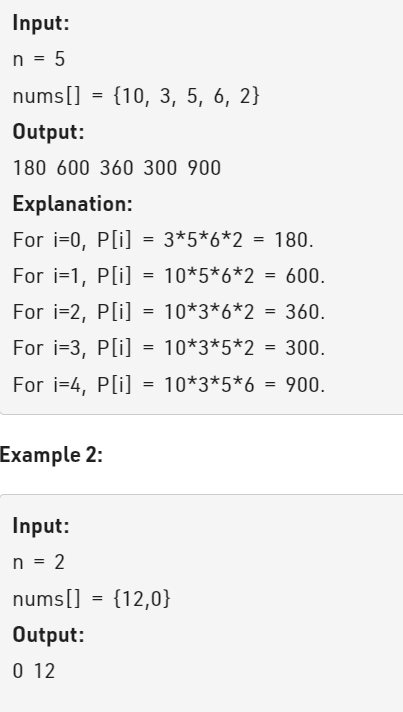

Problem Link : https://practice.geeksforgeeks.org/problems/product-array-puzzle4525/1

Problem Statement : Given an array nums[] of size n, construct a Product Array P (of same size n) such that P[i] is equal to the product of all the elements of nums except nums[i].



---------------------------------------------------------------------------------------------

Solution  :

```
//User function template for C++

class Solution{
  public:
    // nums: given vector
    // return the Product vector P that hold product except self at each index
    vector<long long int> productExceptSelf(vector<long long int>& nums, int n) {
       
        if(n == 1) return {1};
        vector<long long > prefixProduct(n);
        vector<long long > suffixProduct(n);
        prefixProduct[0] = nums[0];
        suffixProduct[n-1] = nums[n-1];
        vector<long long> ans(n);
        
        for(int i=1;i<n;i++){
            prefixProduct[i] = prefixProduct[i-1] * nums[i];
        }
        for(int i=n-2;i>=0;i--){
            suffixProduct[i] = suffixProduct[i+1] * nums[i];
        }
        ans[0] = suffixProduct[1];
        ans[n-1] = prefixProduct[n-2];
        for(int i=1;i<n-1;i++){
            ans[i] = prefixProduct[i-1] * suffixProduct[i+1];
        }
        return ans;
    }
};

TC : O(n)
SC : O(1)
```