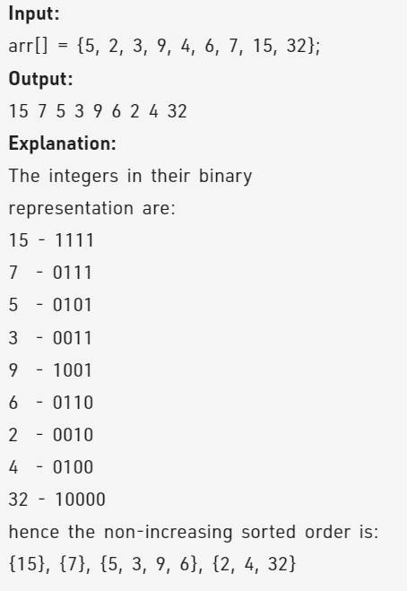

Problem Link : https://practice.geeksforgeeks.org/problems/sort-by-set-bit-count1153/1

Problem Statement : Given an array of integers, sort the array (in descending order) according to count of set bits in binary representation of array elements. 

Note: For integers having same number of set bits in their binary representation, sort according to their position in the original array i.e., a stable sort.



----------------------------------------------------------------------------------------------------
Solution 1 : Hashing 

```
class Solution{
    public:  
    void sortBySetBitCount(int arr[], int n){
        multimap<int,int, greater<int>> mp;
        for(int i=0;i<n;i++){
            int setBits = __builtin_popcount(arr[i]);
            mp.insert({setBits, arr[i]});
        }
        int idx = 0;
        for(auto i : mp){
            arr[idx] = i.second;
            idx++;
        }
    }
};

TC : O(nlog(n))
SC : O(n)
```
--------------------------------------------------------------------------------------------------

Solution 2 : 

```
class Solution{
    public:
    static bool cmp(int a, int b){
        int setBitsOfA = __builtin_popcount(a);
        int setBitsOfB = __builtin_popcount(b);
        return setBitsOfA > setBitsOfB;
    }
    
    void sortBySetBitCount(int arr[], int n){
        stable_sort(arr, arr+n, cmp);
    }
};

TC : O(nlog(n))
SC : O(1)
```

