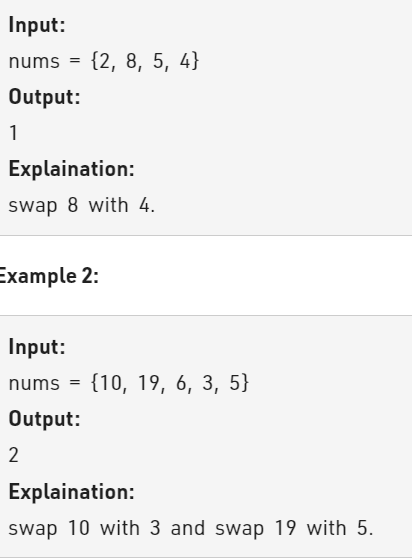

Problem Link : https://practice.geeksforgeeks.org/problems/minimum-swaps/1

Problem Statement :  Given an array of n distinct elements. Find the minimum number of swaps required to sort the array in strictly increasing order.



---------------------------------------------------------------------------------------------------------

### Hashmap Solution

i) Create a sorted copy of the given array and also store the elements across its index in map
ii) if the two corresponding elements of array does not match then swap the two elements using
the index stored in map and increment number of swaps.
iii) once swapped, update the index of swapped elements in hash map

```


class Solution 
{
    public:
    //Function to find the minimum number of swaps required to sort the array. 
	int minSwaps(vector<int>&nums){
	    unordered_map<int,int> mp;
	    vector<int> temp = nums;
	    sort(temp.begin(), temp.end());
	    for(int i=0;i<nums.size();i++){
	        mp[nums[i]] = i;
	    }
	    int ans = 0;
	    for(int i=0;i<nums.size();i++){
	        if(temp[i] != nums[i]){
	            int num = nums[i];
	            ans++;
	            swap(nums[i], nums[mp[temp[i]]]);
                
                mp[num] = mp[temp[i]];
                mp[temp[i]] = i;
	        }
	    }
	    return ans;
	}
};

TC : O(nlogn)
SC : O(n)
```