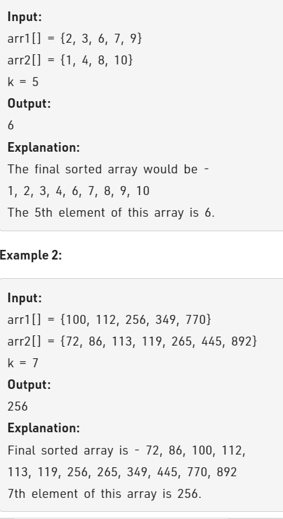

Problem Link : https://practice.geeksforgeeks.org/problems/k-th-element-of-two-sorted-array1317/1

Problem Statement : Given two sorted arrays arr1 and arr2 of size N and M respectively and an element K. The task is to find the element that would be at the k’th position of the final sorted array.



---------------------------------------------------------------------------------------------------

### Solution1 :   Two Pointers

```
class Solution{
    public:
    int kthElement(int arr1[], int arr2[], int n, int m, int k){
        int p = 0;
        int q = 0;
        int lastEle = -1;
        while(p < n && q < m){
            if(arr1[p] <= arr2[q]){
                lastEle = arr1[p];
                p++;
            }
            else{
                lastEle = arr2[q];
                q++;
            }
            k--;
            if(k == 0){
                return lastEle;
            }
        }
        while(p < n){
            lastEle = arr1[p];
            p++; k--;
            if(k == 0) return lastEle;
        }
        while(q < m){
            lastEle = arr2[q];
            q++; k--;
            if(k == 0) return lastEle;
        }
    }
};

TC : O(k)
SC : O(1)
```
---------------------------------------------------------------------------------------------
### Solution2 : Binary Search
Let's say i pick up some x elements from arr1 and k-x elements from arr2.<br>
Then all the elements picked should be less than all the unpicked elements.<br>
say l1 is the max of all element picked from arr1 and l2 is the max of all picked elements of arr2. Similarly, say r1 is the min of all elements picked from arr1 and r2 is the min of all elements of arr2<br>
if(l1 <= r2 && l2 <= r1) then the kth smallest element would be max(l1,l2)<br>
else if(l1 > r2) that means the some elements has to unpicked of arr1, so we move towards mid-1<br>
else we need to pick some more of arr1, so we move towards mid+1;

```
class Solution{
    public:
    int kthElement(int arr1[], int arr2[], int n, int m, int k){
        if(n > m) return kthElement(arr2, arr1, m, n, k);
        
        int lo = max(0, k-m);
        int hi = min(k,n);
        
        while(lo <= hi){
            int cut1 = (lo + hi) >> 1;
            int cut2 = k - cut1;
            int l1 = cut1 == 0 ? INT_MIN : arr1[cut1-1];
            int l2 = cut2 == 0 ? INT_MIN : arr2[cut2-1];
            int r1 = cut1 == n ? INT_MAX : arr1[cut1];
            int r2 = cut2 == m ? INT_MAX : arr2[cut2];
            
            if(l1 <= r2 && l2 <= r1){
                return max(l1,l2);
            }
            else if(l1 > r2){
                hi = cut1- 1;
            }
            else lo = cut1 + 1;
        }
        return 1;
    }
};

TC : O(min(logn, logm));
SC : O(1)

```