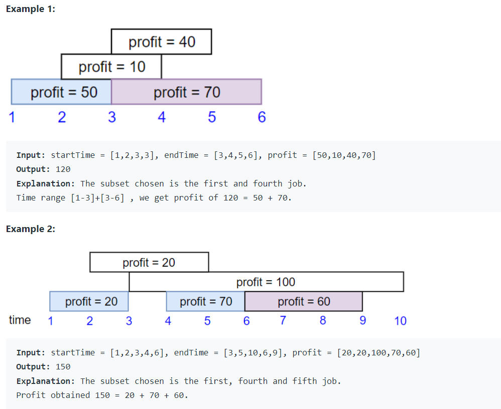

Problem Link : https://leetcode.com/problems/maximum-profit-in-job-scheduling/

Problem Statement : We have n jobs, where every job is scheduled to be done from startTime[i] to endTime[i], obtaining a profit of profit[i].

You're given the startTime, endTime and profit arrays, return the maximum profit you can take such that there are no two jobs in the subset with overlapping time range.

If you choose a job that ends at time X you will be able to start another job that starts at time X.



------------------------------------------------------------------------------------------------------

### Solution 1
We don't know on what parameter we can choose the jobs.
So, let the DP decide.

```
class Solution {
public:
    static bool cmp(vector<int>&a, vector<int>&b){
        return a[1] < b[1];
    }
    int latestJob(vector<vector<int>>&jobs, int idx){
        for(int i=idx-1;i>=0;i--){
            if(jobs[i][1] <= jobs[idx][0]){
                return i;
            }
        }
        return -1;
    }
    int jobScheduling(vector<int>& startTime, vector<int>& endTime, vector<int>& profit) {
        int n = profit.size();
        vector<vector<int>> jobs(n);
        for(int i=0;i<n;i++){
            jobs[i] = {startTime[i], endTime[i], profit[i]};
        }
        sort(jobs.begin(), jobs.end(), cmp);
        vector<int> dp(n);
        dp[0] = jobs[0][2];
        for(int i=1;i<n;i++){
            int includeProfit = jobs[i][2];
            int latestCompletedJob = latestJob(jobs, i);
            if(latestCompletedJob != -1){
                includeProfit += dp[latestCompletedJob];
            }
            
            dp[i] = max(dp[i-1], includeProfit);
        }
        
        return dp[n-1];
    }
};


TC : O(n*n)
SC : O(n)

```


--------------------------------------------------------------------------------------
Binary Search Optimization

```
class Solution {
public:
    static bool cmp(vector<int>&a, vector<int>&b){
        return a[1] < b[1];
    }
    int latestJob(vector<vector<int>>&jobs, int idx){
    
        int lo = 0;
        int hi = idx-1;
        int ans = -1;
        while(lo <= hi){
            int mid = lo + (hi-lo)/2;
            if(jobs[mid][1] <= jobs[idx][0]){
                ans = mid;
                lo = mid+1;
            }
            else{
                hi = mid-1;
            }
        }
        return ans;
    }
    int jobScheduling(vector<int>& startTime, vector<int>& endTime, vector<int>& profit) {
        int n = profit.size();
        vector<vector<int>> jobs(n);
        for(int i=0;i<n;i++){
            jobs[i] = {startTime[i], endTime[i], profit[i]};
        }
        sort(jobs.begin(), jobs.end(), cmp);
        
        vector<int> dp(n);
        dp[0] = jobs[0][2];
        for(int i=1;i<n;i++){
            int includeProfit = jobs[i][2];
            int latestCompletedJob = latestJob(jobs, i);
            if(latestCompletedJob != -1){
                includeProfit += dp[latestCompletedJob];
            }
            
            dp[i] = max(dp[i-1], includeProfit);
        }
        
        return dp[n-1];
    }
};

TC : O(nLogn)
SC : O(n)
```
