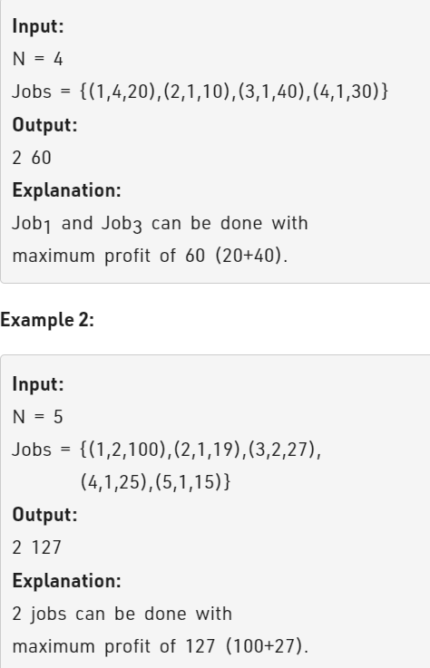

Problem Link : https://practice.geeksforgeeks.org/problems/job-sequencing-problem-1587115620/1

Problem Statement : Given a set of N jobs where each jobi has a deadline and profit associated with it.

Each job takes 1 unit of time to complete and only one job can be scheduled at a time. We earn the profit associated with job if and only if the job is completed by its deadline.

Find the number of jobs done and the maximum profit.

Note: Jobs will be given in the form (Jobid, Deadline, Profit) associated with that Job.



------------------------------------------------------------------------------------------------------

### Solution 1

Sort by profit and accumulate as many jobs as you can

```
/*
struct Job 
{ 
    int id;	 // Job Id 
    int dead; // Deadline of job 
    int profit; // Profit if job is over before or on deadline 
};
*/
 bool cmp(Job j1, Job j2){
        return j1.profit > j2.profit;
}

class Solution 
{
    public:
   
    //Function to find the maximum profit and the number of jobs done.
    vector<int> JobScheduling(Job arr[], int n) { 
        // your code here
        // vector<bool> visisted(n,false);
        sort(arr,arr+n,cmp);
        // for(int i=0;i<n;i++){
        //     cout << arr[i].profit << " " << arr[i].dead << endl;
        // }
        int max_deadline= 0;
        for(int i=0;i<n;i++){
            max_deadline = max(max_deadline, arr[i].dead);
        }
        int cnt = 0;
        int max_profit = 0;
        vector<int> ans(max_deadline+1,false);
        for(int i=0;i<n;i++){
            int deadline = arr[i].dead;
            if(ans[deadline] == 0){
                ans[deadline] = 1;
                max_profit += arr[i].profit;
                cnt++;
            }
            else{
                for(int j=deadline-1;j>=1;j--){
                    if(ans[j] == 0){
                        ans[j] = 1;
                        max_profit += arr[i].profit;
                        cnt++;
                        break;
                    }
                }
            }
        }
        return {cnt, max_profit};
    } 
};

TC : O(n*n)
SC : O(max_deadline)

```