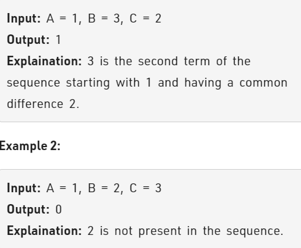

Problem Link : https://practice.geeksforgeeks.org/problems/arithmetic-number2815/1

Problem Statement : Given three integers  'A' denoting the first term of an arithmetic sequence , 'C' denoting the common difference of an arithmetic sequence and an integer 'B'. you need to tell whether 'B' exists in the arithmetic sequence or not. Return 1 if B is present in the sequence. Otherwise, returns 0.



-----------------------------------------------------------------------------------------------
### Solution : 
AP formula : A<sub>n</sub> = A<sub>1</sub> + (n-1)d<br>

Therefore, <br>
B = A  + (n-1)*C<br>
n =  (B-A) / C + 1

From this we can say that if <br>
i) C == 0, then A has to be equal to B (A == B)<br>
ii) n has to be positive integer. Therefore, (B-A)/C > 0 && (B-A)%C == 0;

else return 0;

```
// User function Template for C++

class Solution{
public:
    int inSequence(int A, int B, int C){
        if(C == 0) return (A == B);
        if(A == B) return 1;
        if((B-A)%C == 0 && (B-A)/C > 0) return 1;
        return 0;
    }
};

TC : O(1)
SC : O(1)
```
