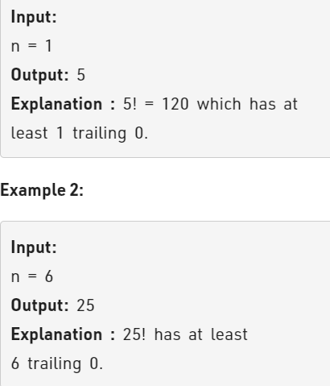

Problem Link : https://practice.geeksforgeeks.org/problems/smallest-factorial-number5929/1

Problem Statement : Given a number n. The task is to find the smallest number whose factorial contains at least n trailing zeroes



-----------------------------------------------------------------------------------------------

### Solution :
No of trailing zeros in any no's factorial is equal to the total cnt of 5 in it.

for eg : 10! = 10*9*8*7*6*5*4*3*2*1  == 3628800

Here 10 = 5 * 2 and 5 = 5*1. SO total number of 5's = 2 . Hence, 2 trailing zeros.

CODE : 
```
class Solution{
    public:
        int findNum(int n){
            int num = 5;
            int cnt = 0;
            while(cnt < n){
                int k = num;
                while(k%5 == 0){
                    cnt++;
                    k = k/5;
                }
                if(cnt >= n) return num;
                num= num + 5;
            }
            return num;
        }
};


```
TC : Log <sub>5</sub>(n)<br>
SC : O(1)