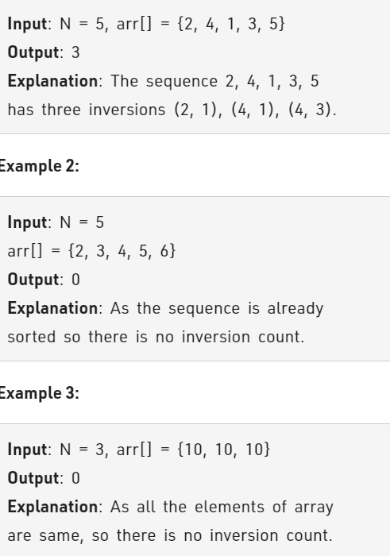

Problem Link : https://practice.geeksforgeeks.org/problems/inversion-of-array-1587115620/1

Problem Statement : Given an array of integers. Find the Inversion Count in the array. 

Inversion Count: For an array, inversion count indicates how far (or close) the array is from being sorted. If array is already sorted then the inversion count is 0. If an array is sorted in the reverse order then the inversion count is the maximum. 
Formally, two elements a[i] and a[j] form an inversion if a[i] > a[j] and i < j.



### Solution : Merge Sort


apply merge sort and during merging operation, any element from leftArray is less than an element from rightArray,<br> then the number of elements that adds up to inversions will be leftArraySize - p(p is the pth element of leftArray)

eg : arr = {2,4,1,3,5}

if we start from lowest possible arrays,<br>
leftArr = {2}, rightArr = {4}
here all elements of leftArr are smaller than all elements of rightArr

leftArr = {2,4}, rightArr = {1}<br>
here 2 is greater than 1. this means that all elements from 2 till end of leftArr would be greater than 1, this will create <br> 
leftArrSize(2) - p(0)  = 2 inversions

Similarly, leftArr = {1,2,4}, rightArr={3,5}<br>
Here, 4 is greater than 3, hence inversions = 3(leftArrSize) - 2(p) = 1;<br>
total inversion = 3;

CODE:
```
class Solution{
  public:
    // arr[]: Input Array
    // N : Size of the Array arr[]
    // Function to count inversions in the array.
    
    void mergeArrays(long long arr[], int lo, int hi,int mid ,long long &inversions){
        int leftSize = mid - lo + 1;
        int rightSize = hi - mid;
        long long leftArray[leftSize+1];
        leftArray[leftSize] = 1e18 + 5;
        long long rightArray[rightSize + 1];
        rightArray[rightSize] = 1e18 + 5;
        
        for(int i=0;i<leftSize;i++){
            leftArray[i] = arr[lo + i];
        }
        for(int i=0;i<rightSize;i++){
            rightArray[i] = arr[mid + 1 + i];
        }
        
        int p = 0;
        int q = 0;
        for(int i=lo;i<=hi;i++){
            if(leftArray[p] <= rightArray[q]){
                arr[i] = leftArray[p++];
            }
            else{
                inversions += (leftSize - p);
                arr[i] = rightArray[q++];
            }
        }
    }
    
    void mergeSort(long long arr[], long long &N, int lo, int hi, long long &inversions){
        if(lo >= hi) return;
        int mid = (lo + hi)/2;
        mergeSort(arr, N, lo, mid, inversions);
        mergeSort(arr, N, mid+1, hi, inversions);
        mergeArrays(arr, lo, hi, mid, inversions);
    }
    
    long long int inversionCount(long long arr[], long long N){
        long long inversions = 0 ;
        mergeSort(arr, N, 0, N-1, inversions);
        return inversions;
    }

};
```

TC : O(NLogN)<br>
SC : O(n)