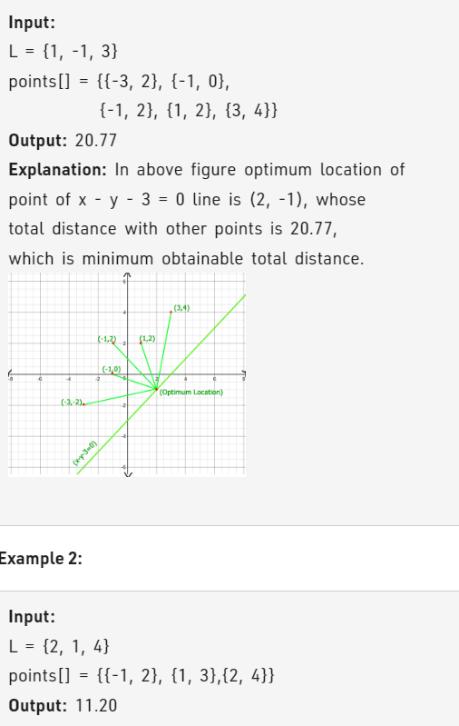

Problem Link : https://practice.geeksforgeeks.org/problems/optimum-location-of-point-to-minimize-total-distance/1

Problem Statement : Given a set of coordinates points of the form [p, q] and a line L of the form ax + by + c = 0. The task is to find a point on a given line for which the sum of distances from a given set of coordinates is minimum.



---------------------------------------------------------------------------------------------
Here, the search space will be a point at -infinity to +infinity.<br>
As we approach the points cluster from -infinity, then the distance will keep decreasing.<br>
After a certain minimum distance, the distance will again increase. <br>
This means the function is  unimodal. Hence, we will use a ternary search.

CODE :


```

const double eps = 1e-3;
class Solution{
    public:
    
    double distance(double x, double y, pair<int,int> &p){
        return sqrt((x - p.first)*(x-p.first) + (y-p.second)*(y-p.second));
    }
    
    double compute(vector<pair<int,int>>&p, tuple<int,int,int>&l, int n, double x){
        double res = 0;
        int a = get<0>(l);
        int b = get<1>(l);
        int c = get<2>(l);
        double y = -1*(a*x + c)/b;
        
        for(int i=0;i<n;i++){
            res += distance(x, y, p[i]);
        }
        return res;
    }
    
    double findOptimumCost(tuple<int,int,int>l, vector<pair<int,int>>p, int n){
	    double lo = -1e8;
	    double hi = 1e8;
	    while(hi - lo > eps){
	        double mid1 = lo + (hi - lo)/3;
	        double mid2 = hi - (hi - lo)/3;
	        
	        double d1 = compute(p, l, n, mid1);
	        double d2 = compute(p, l, n, mid2);
	        
	        if(d1 < d2){
	            hi = mid2;
	        }
	        else lo = mid1;
	    }
	    return compute(p, l, n, lo);
    }
};
TC : O(nlog(n*10^2))
SC : O(1)
```