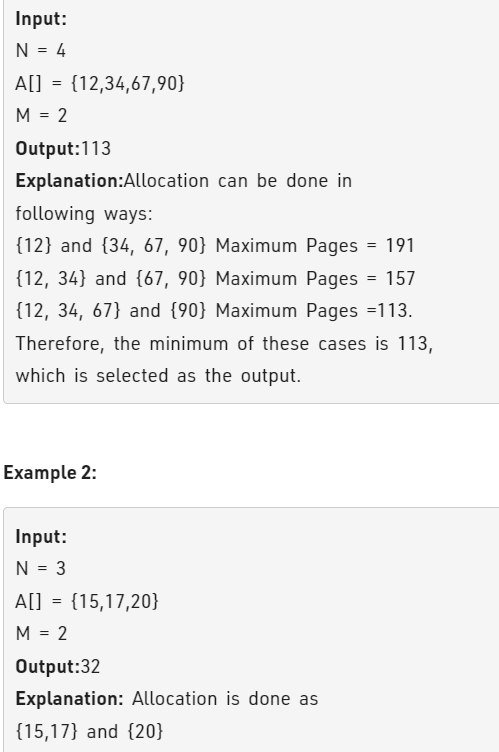

Problem Link : https://practice.geeksforgeeks.org/problems/allocate-minimum-number-of-pages0937/1

Problem  Statement : You are given N number of books. Every ith book has Ai number of pages. 
You have to allocate contiguous books to M number of students. There can be many ways or permutations to do so. In each permutation, one of the M students will be allocated the maximum number of pages. Out of all these permutations, the task is to find that particular permutation in which the maximum number of pages allocated to a student is the minimum of those in all the other permutations and print this minimum value.

Each book will be allocated to exactly one student. Each student has to be allocated at least one book.

Note: Return -1 if a valid assignment is not possible, and allotment should be in contiguous order (see the explanation for better understanding).




-------------------------------------------------------------------------------------------------
### Solution : Binary Search

CODE : 
```
//User function template in C++

class Solution 
{
    public:
    bool canAllocate(int A[], int maxPages, int M, int N){
        int count = 1;
        int totalPages = 0;
        for(int i=0;i<N;i++){
            if(A[i] > maxPages) return false;
            if(totalPages + A[i] > maxPages){
                count++;
                totalPages = A[i];
            }
            else{
                totalPages += A[i];
            }
        }
        if(count > M) return false;
        return true;
    }
    
    //Function to find minimum number of pages.
    int findPages(int A[], int N, int M) {
        if(M > N) return -1;
        int lo = INT_MAX, hi = 0;
        for(int i=0;i<N;i++){
            lo = min(lo, A[i]);
            hi += A[i];
        }
        while(lo <= hi){
            int mid = lo + (hi - lo)/2;
            if(canAllocate(A,mid,M, N)){
                hi = mid-1;
            }
            else lo = mid+1;
        }
        return lo;
        
    }
};

TC : O(nLogn)
SC : O(1)
```