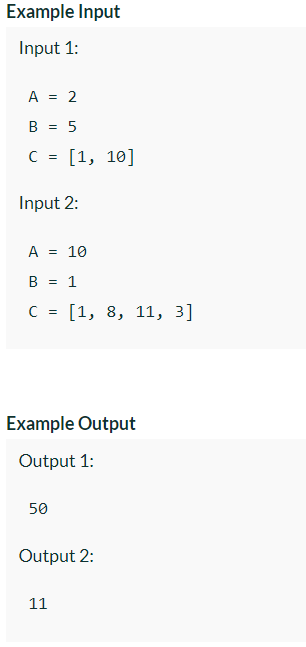

Problem Link : https://www.interviewbit.com/problems/painters-partition-problem/

Problem Statement : Given 2 integers A and B and an array of integers C of size N. Element C[i] represents the length of ith board.

 You have to paint all N boards [C0, C1, C2, C3 … CN-1]. There are A painters available and each of them takes B units of time to paint 1 unit of the board.

Calculate and return the minimum time required to paint all boards under the constraints that any painter will only paint contiguous sections of the board.<br>
 NOTE: <br>
 1. 2 painters cannot share a board to paint. That is to say, a board cannot be painted partially by one painter, and partially by another.<br>
 2. A painter will only paint contiguous boards. This means a configuration where painter 1 paints boards 1 and 3 but not 2 is invalid.

 Return the ans % 10000003.



--------------------------------------------------------------------------------------------------

### Solution : Binary Search

```
const int mod = 10000003;
bool canPartition(vector<int>&C, int maxUnits, int A){
    int count = 1;
    int currUnits = 0;
    for(auto i : C){
        if(i > maxUnits){
            return false;
        }
        else if(currUnits + i > maxUnits){
            count++;
            currUnits = i;
        }
        else currUnits += i;
    }
    return (A >= count);
}


int Solution::paint(int A, int B, vector<int> &C) {
    int lo = *max_element(C.begin(), C.end());
    int hi = 0;
    for(auto i : C) hi += i;
    if(A >= C.size()) return lo * B;
    while(lo <= hi){
        int mid = lo + (hi-lo)/2;
        if(canPartition(C, mid, A)){
            hi = mid-1;
        }
        else lo = mid+1;
    }
    return (lo%mod*1ll * B%mod)%mod;
}

TC: O(nlogn)
SC : O(1)
```